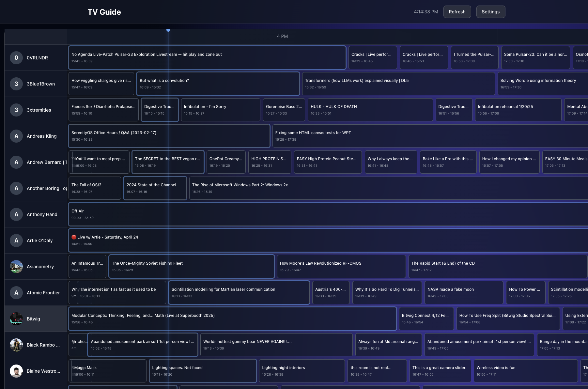

# YouTube TeeVee

Transform your YouTube subscriptions into a traditional TV experience with synchronized timeline-based programming.



## Prerequisites

- **Docker** and **Docker Compose**
- **yt-dlp**: `brew install yt-dlp` (macOS) or `pip install yt-dlp`
- **jq**: `brew install jq` (macOS) or `sudo apt install jq`
- Logged into YouTube in Chrome/Firefox/Safari/Edge

## Quick Start

1. **Clone and setup**
   ```bash
   git clone https://github.com/stevemurr/youtube-teevee.git
   cd youtube-teevee
   cp .env.example .env
   ```

2. **Populate database** (uses browser cookies, takes 10-20 min)
   ```bash
   ./scripts/populate-db.sh
   # Or specify browser: ./scripts/populate-db.sh --browser firefox
   ```

3. **Run the app**
   ```bash
   docker-compose up
   ```

4. **Open** http://localhost:8091

## Updating Content

```bash
./scripts/populate-db.sh  # Fetches new videos from subscriptions
```

## Project Structure

```
youtube-teevee/
├── api/          # Express + SQLite backend
├── frontend/     # React + Vite frontend
├── caddy/        # Reverse proxy config
├── scripts/      # Database population scripts
└── docker-compose.yml
```

## License

MIT
